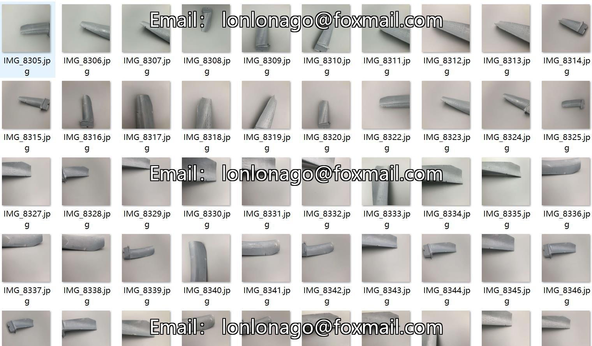
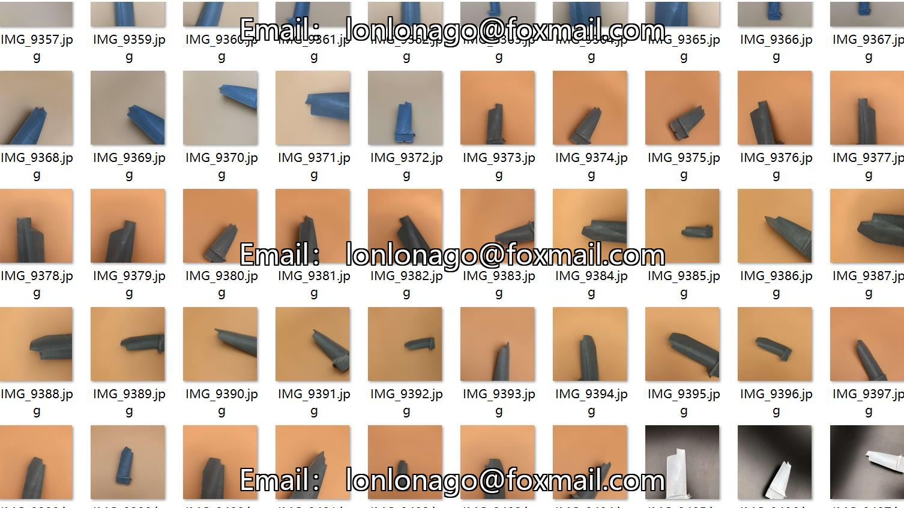
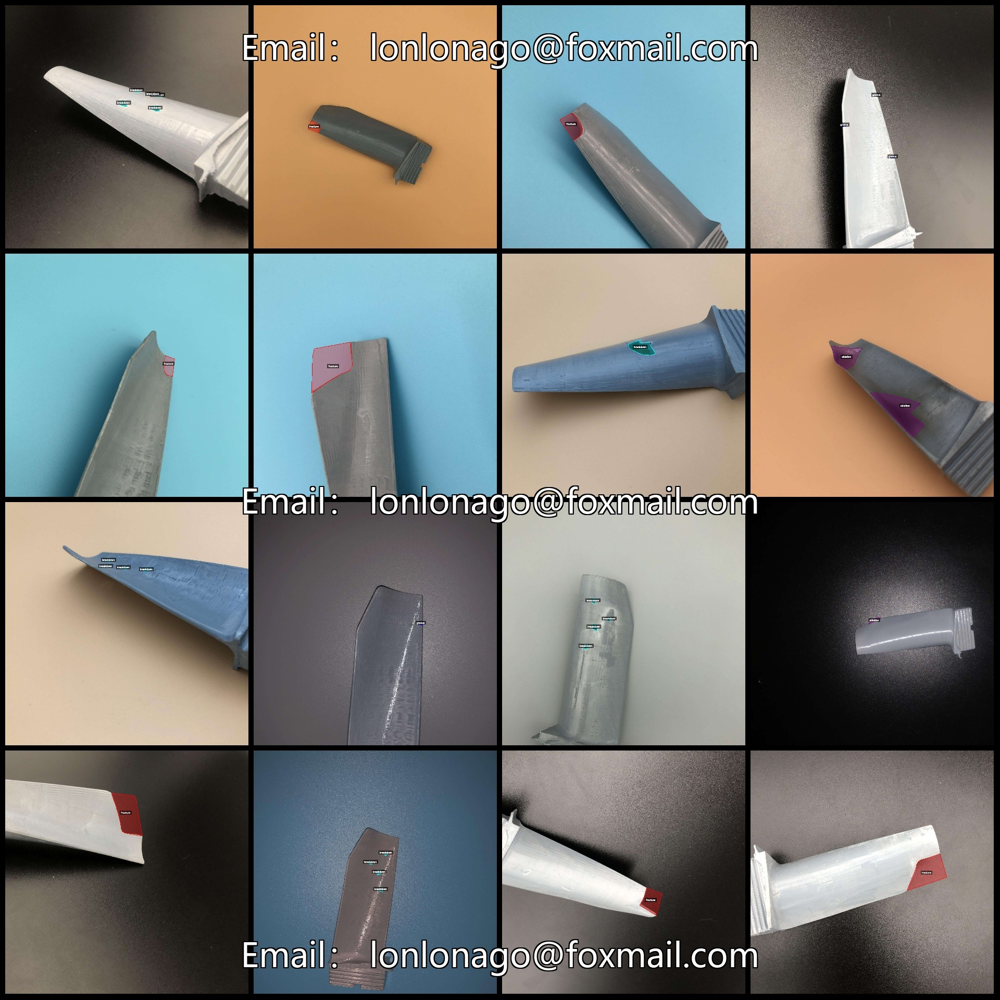
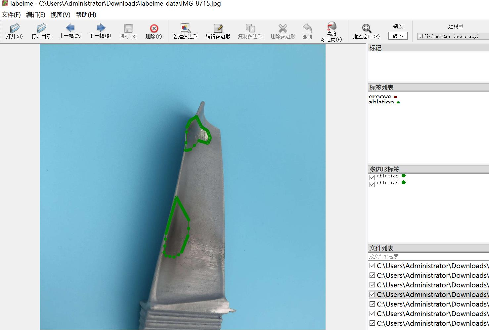

# AeBAD Aero Engine Bladed Disc Abnormality Identification and Segmentation Dataset - LabelMe Format, 1149 Images, 4 Categories

dataset format: labelme format(without maskfile, only containing jpgimage and corresponding jsonfile)
number of images: 1149  
annotation count: 1149  
annotationnumber of classes: 4  
annotation class names:["groove","ablation","breakdown","fracture"]  
boxes per class:   
Groove (Slot) Count = 484
Ablation (Evaporation) Count = 279
Breakdown (Leakage/Damage) Count = 988
Fracture (Cracking) Count = 389
total boxes: 2140  
Use the annotation tool: labelme=5.5.0
image resolution: 1920x1920  
Annotation Rules: Draw a polygon frame around the class.
Important Notes: You can use LabelMe to open and edit the dataset. JSONDataset needs to be converted into mask or Yolo format or COCO format for semantic segmentation or instance segmentation.
Special Statement: This dataset does not guarantee the accuracy of the trained model or the weights file.
If you need to cite the dataset, please refer to the following introduction and format:
Dataset Introduction
The Real World Aircraft Engine Blades Abnormal Detection (AeBAD) dataset consists of two subdatasets: single blade dataset (AeBAD-S) and blade video abnormal detection dataset (AeBAD-V).
Compared with the existing dataset, AeBAD has the following two characteristics: 1. The target samples are not aligned and are at different scales.
2.) The distribution of normal samples in the test set and training set has domain shift, mainly caused by changes in lighting and viewpoint.
@article{zhang2023industrial,  
title={Industrial Anomaly Detection with Domain Shift: A Real-world Dataset and Masked Multi-scale Reconstruction},  
author={Zhang, Zilong and Zhao, Zhibin and Zhang, Xingwu and Sun, Chuang and Chen, Xuefeng},  
journal={arXiv preprint arXiv:2304.02216},  
year={2023}  
}  
Image preview:  
Annotation example:
The original image (choose 16 images to show):
Annotation drawing result:  
Labelme editing example diagram:
## Images

Here is a pay link on Stripe ( https://buy.stripe.com/3cs8yP7sY87d0vu9AB ). Please contact me lonlonago@foxmail.com after funding $89, and I will send you a complete data files , thank you!

